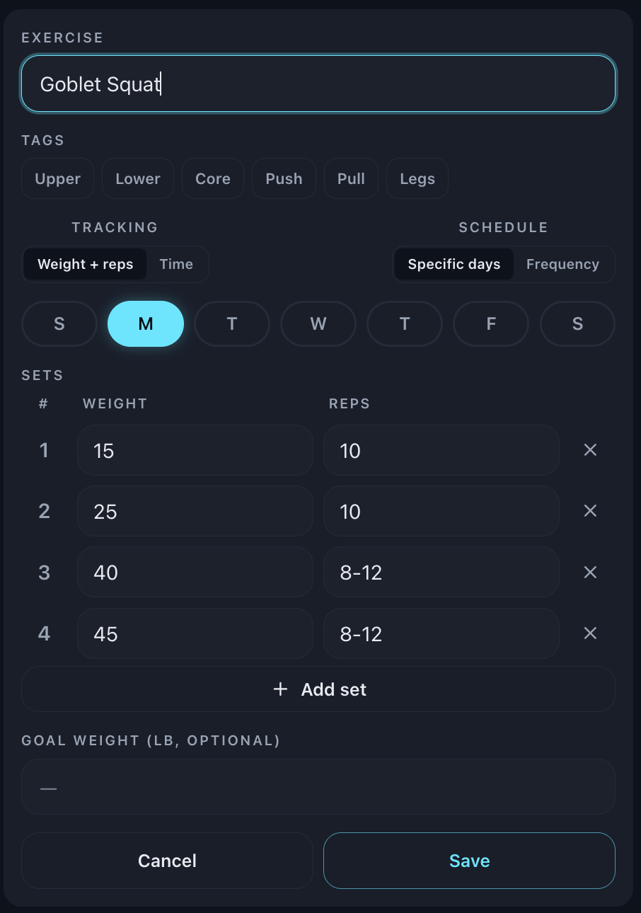
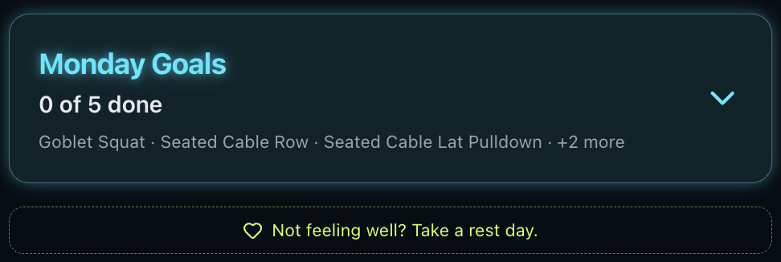
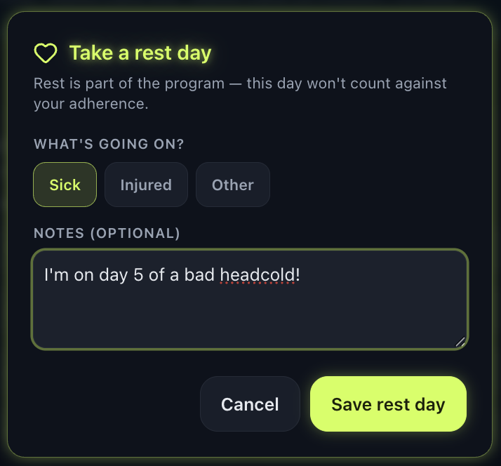

# Zenith

Zenith is a fitness goal-tracking app for weightlifting and cardio
(running, biking, swimming, etc.). You create programs, schedule
exercises across the week, log your sessions, and watch your adherence
and volume trend over time. It's a **PWA** — install it to your phone's
home screen and it runs full-screen, no App Store needed.

Live at **<https://zenith-theta-puce.vercel.app/>**.

---

## For users

### What it does

- **Track weightlifting and cardio.** Build programs out of individual
  exercises. Weightlifting logs sets / reps / weight (or held duration
  for things like planks). Cardio logs distance and time for running,
  cycling, swimming, etc.
- **Programs as plans.** Each program holds its own exercises with their
  own schedule — pinned weekdays ("Mon/Wed/Fri") or a frequency target
  ("3x per week"). Programs can also carry rollup goals like "30 min of
  cardio per day" or "5 mi of running per week" that aggregate across
  every matching session you log.
- **Adherence at a glance.** Day / week / month rings on the progress
  screen show how close you are to your scheduled work. Volume charts
  show weekly trend for strength and cardio, with tag and per-exercise
  filters layered on top.
- **Rest when you need to.** If you're sick or injured, log a rest day
  with a reason and optional note. Skipped workouts on rest days do
  **not** count against your adherence — they're treated as "out of
  program" rather than misses, so taking care of yourself doesn't tank
  your stats.

### How to use it

1. **Sign in** with Google.
2. **Create a program** — pick a category (Weight Lifting or Cardio),
   give it a name, then add exercises. Type a name and Zenith will
   suggest matches from its catalog (with sensible default tags and
   tracking type). Set a schedule per exercise.

   

3. **Log from the home screen.** "Today" shows what's scheduled. Tap an
   exercise card to log sets, then save. You can also pick any
   catalog exercise ad-hoc from the home screen without attaching it
   to a program.
4. **Check progress** on the Progress screen. Filter the volume charts
   by tag (push/pull/legs, zone-2/vo2-max, etc.) or by specific
   exercise to see what's actually moving.
5. **Mark a rest day** from the home screen when you're sick or
   injured. Those days won't be counted as misses.

   

   

6. **Export / import** your data as JSON at any time via the data
   menu — useful for backups.

### How to request an account

Zenith is invite-only right now. To request access, **reach out to me**.

Sign-in uses **Google authentication only**, so you'll need a valid
Google / Gmail account. Once I approve you, I'll add your account to
the allowlist in the
[Firebase Auth users console](https://console.firebase.google.com/project/zenith-88099/authentication/users)
and you'll be able to sign in from the live URL above.

### Data & privacy

Zenith stores **only** what you explicitly enter into it. There is no
analytics, no tracking pixels, no third-party telemetry.

- **What's collected:** the Google account info Firebase Authentication
  exposes (display name, email, profile picture URL, Google UID), plus
  the workout data you create — programs, exercises, logged sessions,
  rest days.
- **Where it lives:** in [Cloud Firestore](https://firebase.google.com/products/firestore)
  under a Firebase project I (the maintainer) operate. Data is scoped
  per-user via Firestore security rules — your records are only
  readable/writable by your own signed-in session.
- **Who can see it:** I can see allowlisted users in the Firebase Auth
  console (names + emails) and, as the project owner, I have technical
  read access to the underlying Firestore documents. I don't routinely
  look at them, but you should know it's possible.
- **Export / delete:** every account can export the full dataset as
  JSON from the in-app data menu at any time. To delete your account
  and all associated Firestore data, reach out via my GitHub profile
  ([@kkauff](https://github.com/kkauff)) and I'll remove both the
  allowlist entry and the data.

If you're not comfortable with the above, the project is MIT-licensed
and self-hostable — see the
[Firebase setup](#firebase-setup-one-time) section to run your own
Firebase project so the data lives entirely under your control.

### Installing it on your phone (PWA)

Once you can sign in, install Zenith to your home screen so it
launches full-screen like a native app — no App Store needed.

**iPhone / iPad (Safari only — Chrome on iOS can't install PWAs):**

1. Open <https://zenith-theta-puce.vercel.app/> in **Safari**.
2. Tap the **Share** button (the square with the up-arrow) at the
   bottom of the screen.
3. Scroll down and tap **Add to Home Screen**.
4. Confirm the name ("Zenith") and tap **Add** in the top-right.
5. The Zenith icon appears on your home screen. Tap it to launch —
   it runs full-screen, no browser chrome.

**Android (Chrome):**

1. Open <https://zenith-theta-puce.vercel.app/> in **Chrome**.
2. Chrome usually shows an **Install** prompt at the bottom of the
   screen — tap **Install** and you're done.
3. If you don't see the prompt: tap the **⋮** menu (top-right) and
   choose **Install app** (or **Add to Home screen**).
4. Confirm. The Zenith icon appears in your app drawer / home
   screen. Tap it to launch full-screen.

After installing, sign in with Google once and you'll stay signed in
across launches.

---

## Architecture

- **Frontend:** Vite + React + TypeScript, styled with Tailwind.
- **Hosting:** [Vercel](https://vercel.com). Every push to `main`
  auto-deploys. Live at <https://zenith-theta-puce.vercel.app/>.
- **Auth:** Firebase Authentication, Google provider only.
- **Storage:** Cloud Firestore. Data is scoped per signed-in user
  under `users/{uid}/...` (programs, exercise library, logged
  instances, rest days). Firestore security rules restrict each
  document subtree to its owning UID — a user can only read / write
  their own data.
- **Live sync:** Firestore `onSnapshot` listeners — log a session on
  your phone and the desktop view updates without a reload.
- **PWA:** A Web App Manifest + service worker make the app
  installable to the iOS / Android home screen and runnable
  full-screen offline-friendly. On iOS, open the deployed URL in
  Safari → Share → "Add to Home Screen". On Android, Chrome shows an
  Install prompt automatically (or menu → "Install app").

### Per-user Firestore layout

```
users/{uid}/programs/{programId}     → Program docs (with embedded exercises + rollup goals)
users/{uid}/instances/{instanceId}   → Instance docs (one per logged session)
users/{uid}/library/{exerciseId}     → Library mirror of every exercise ever in a program
users/{uid}/restDays/{YYYY-MM-DD}    → Rest days, keyed by local date
```

The library mirror lets historical instances resolve their exercise
name / tags even after the source program is deleted — programs
behave more like tags than containers.

---

## Features (exhaustive)

### Programs

- Two program categories: **Weight Lifting** and **Cardio**.
  (Nutrition and Mindfulness are scaffolded but not yet available.)
- Multiple programs at once. Programs are organizational tags —
  deleting one does **not** delete your logged sessions; progress
  history survives.
- Each program holds its own list of exercises with their own
  scheduling.
- **Rollup goals** per program: aggregate amount-over-time goals
  ("30 min of cardio M/W/F", "5 mi of running per week"). Matching
  sessions from _any_ program (or ad-hoc catalog logs) count toward
  them.

### Exercises

- **Tracking types:**
  - `weight` — sets × reps × weight (lb).
  - `time` — sets × held duration (planks, hangs, wall sits).
  - `cardio` — every set logs distance **and** time; the goal kind
    decides which one is the headline target.
- **Cardio activities:** Running, Treadmill Running, Outdoor Bike,
  Indoor Bike, Elliptical, Stairmaster, Swimming. Default distance
  unit per activity (miles for road, yards for swim), overridable.
- **Schedules:**
  - `weekly-days` — pinned weekdays (any subset of Sun–Sat).
  - `frequency` — N times per week / month, no specific day attached.
- **Planned sets:** describe what you intend to do (warmups, working
  sets, rep ranges like `8-10`). The log form pre-fills from these.
- **Hardcoded exercise catalog** with ~60 common moves: bench press,
  squat, deadlift, lat pulldown, hammer curl, plank, dead hang, etc.
  Plus the seven cardio activities. Fuzzy matching means "bnch press"
  surfaces "Bench Press"; aliases like "rdl", "ohp", "pullup" all
  resolve.
- **Tags** are auto-applied from the catalog and shown as chips on
  the form:
  - Weightlifting: `upper`, `lower`, `core`, `push`, `pull`, `legs`
  - Cardio: `zone-2`, `threshold`, `vo2-max`, `sprints`, `easy`
  - System: `cardio` (auto-applied to every cardio-category exercise)
- Users can still create fully custom exercises that aren't in the
  catalog — they just pick tags themselves.

### Today screen

- Greeting + day's scheduled exercises across all programs.
- Inline log cards: set the values, tap save, done.
- "Today" includes both pinned-day exercises and frequency-target
  progress for the current period.
- Ad-hoc logging: pick any exercise from the global catalog and log
  it without attaching it to a program.
- Rollup-goal progress rows for the day / period.
- **Rest day modal** with reason (sick / injured / other) and
  optional notes.

### Progress screen

- **Adherence rings** for day, week, and month. Adherence prorates
  uniformly across weekly-pinned days and frequency goals. Rest days
  drop out of the denominator entirely.
- **Adherence insights** with longest streak / current streak / best
  week summaries.
- **Volume charts** — 8-week sparklines for Strength Volume and
  Cardio Volume.
  - Filter by tag (chips for push/pull/legs, zone-2/threshold/etc.).
  - Filter by specific exercise via a multiselect dropdown.
  - Filtered series overlays the overall series on the same y-axis
    so you can compare directly.
  - Trend indicator (up / down / flat) per chart.
- **History** list of every logged session, with delete. Sessions
  whose program was deleted still show, tagged "Removed program";
  ad-hoc sessions are tagged "Ad-hoc".

### Data

- **Per-user isolation** via Firestore security rules.
- **Live cross-device sync** via `onSnapshot`.
- **Export** the full account as JSON.
- **Import** that JSON back — existing records win on conflict, so
  re-importing is a safe no-op.

### Platform

- Installable PWA (iOS Safari + Android Chrome).
- Mobile-first responsive layout.

---

## Roadmap

Next features I'm planning to tackle:

- **User-provided API keys for AI providers** so the app can offer
  AI-driven insights and workflows (training suggestions, weekly
  recaps, plateau detection) using _your_ key — no shared inference
  costs.
- **Strava integration** to auto-import cardio sessions.
- **Garmin integration** — blocked on Garmin developer access being
  gated to businesses; tracking this and will revisit when feasible.
- **Zwift integration** to pull indoor cycling sessions.
- **Improved muscle-group visualization** for strength progression,
  using
  [`react-native-body-highlighter`](https://github.com/Onyo/react-native-body-highlighter)
  (or its web equivalent) to render which muscles you've trained and
  how recently.

---

## For developers

### Run it locally

```sh
npm install
# Create .env.local with your Firebase web config (see below)
npm run dev
```

Open the URL it prints (default `http://localhost:5173`). Click
"Continue with Google", pick an account, and you'll land in an empty
programs list. Sign in with a different Google account and you'll see
a separate (also empty) data set.

```sh
npm run build      # type-check + production build → dist/
npm run preview    # serve dist/ locally to test the PWA
npm run typecheck  # type-check only
```

To regenerate the PWA icons (e.g. if you change the brand color):

```sh
node scripts/gen-icons.mjs
```

### Firebase setup (one-time)

You need a Firebase project for auth + Firestore. The free Spark plan
is more than enough for personal use.

1. Go to [console.firebase.google.com](https://console.firebase.google.com)
   and create a new project.
2. **Enable Authentication:** Authentication → Get started →
   **Sign-in method** → enable **Google** → fill project public name
   - support email → Save.
3. **Enable Firestore:** Firestore Database → Create database →
   **production mode** → pick a nearby region.
4. **Lock down access** — Firestore Database → **Rules**:
   ```
   rules_version = '2';
   service cloud.firestore {
     match /databases/{database}/documents {
       match /users/{userId}/{document=**} {
         allow read, write: if request.auth != null && request.auth.uid == userId;
       }
     }
   }
   ```
5. **Register a web app:** Project Overview → **+ Add app** → web
   (`</>`). Copy the `firebaseConfig`.
6. **Paste config into `.env.local`:**
   ```
   VITE_FIREBASE_API_KEY=...
   VITE_FIREBASE_AUTH_DOMAIN=<project>.firebaseapp.com
   VITE_FIREBASE_PROJECT_ID=<project>
   VITE_FIREBASE_APP_ID=1:...:web:...
   ```
7. Restart `npm run dev` so Vite picks up the new env vars.

When you deploy, set the same four env vars in the hosting provider
and add the deployed origin to **Authentication → Settings →
Authorized domains** (otherwise sign-in popups fail with
`auth/unauthorized-domain`).

### Deploying

Live deploys go to Vercel. Push to GitHub, import the repo on
[vercel.com](https://vercel.com), set the four `VITE_FIREBASE_*`
environment variables, and deploy. Every push to `main` redeploys
automatically. Vite bakes env vars in at build time, so changing them
requires a redeploy.

After the first deploy, add the Vercel origin to Firebase
**Authentication → Settings → Authorized domains**.

### Project structure

```
src/
  App.tsx                top-level component; gates on auth, subscribes to Firestore
  auth.ts                Firebase Auth wrapper (Google provider)
  firebase.ts            Firebase app init from env vars
  storage.ts             Firestore reads / writes / live subscriptions
  types.ts               Program, Exercise, PlannedSet, Instance, RestDay, RollupGoal, …
  templates.ts           categories + helpers (schedule/reps/duration parsing)
  today.ts               "what's scheduled today" + adherence math
  instance.ts            instance helpers — name/tag/tracking-type resolution
  rollup.ts              rollup-goal progress calculations
  exercise-library.ts    hardcoded global exercise catalog + fuzzy matching
  index.css              mobile-first styles
  main.tsx               React entry point
  components/
    Login.tsx                sign-in screen
    AppHeader.tsx            header showing avatar + name + data menu
    Home.tsx                 home / today screen
    TodayBox.tsx             today summary card
    TodayExerciseCard.tsx    inline log card for one exercise
    RestDayModal.tsx         rest-day form
    ActiveProgramsPanel.tsx  program list on the home screen
    NewProgram.tsx           create-a-program form
    ProgramDetail.tsx        view / edit a program
    ProgramsScreen.tsx       all programs view
    ExerciseForm.tsx         add / edit a single exercise
    ExercisePicker.tsx       catalog-driven exercise picker
    SchedulePicker.tsx       weekday / frequency picker
    SetEditor.tsx            planned-sets editor
    RollupGoalForm.tsx       rollup goal create/edit form
    RollupProgressRow.tsx    rollup goal progress row
    ProgressScreen.tsx       progress wrapper
    ProgressPanel.tsx        strength + cardio volume charts
    ProgressSummaryPanel.tsx home-screen mini progress summary
    AdherenceRings.tsx       day/week/month adherence rings
    AdherenceInsights.tsx    streaks + insights summary
    ProgressRing.tsx         single-ring SVG primitive
    HistoryPanel.tsx         logged-instance history
    MultiselectDropdown.tsx  reusable multiselect with pills
    ConfirmDialog.tsx        confirm modal
public/
  pwa-*.png            PWA icons (used by manifest)
  apple-touch-icon.png iOS home-screen icon
  favicon.svg          browser tab icon
scripts/
  gen-icons.mjs        regenerates the icons above
```

---

## Contributing

Issues and PRs are welcome — see [CONTRIBUTING.md](CONTRIBUTING.md) for
the (light) process. For security issues, please follow
[SECURITY.md](SECURITY.md) instead of filing a public issue.

---

## Credits

- **Knewave Outline** display font by Tyler Finck — distributed via
  [The League of Moveable Type](https://www.theleagueofmoveabletype.com/knewave)
  under the [SIL Open Font License 1.1](public/fonts/OFL.txt).
  The font file is bundled in `public/fonts/` alongside its OFL.
- Icons from [Lucide](https://lucide.dev) (ISC license).
- UI primitives adapted from [shadcn/ui](https://ui.shadcn.com) (MIT).

---

## License

Zenith is licensed under the **MIT License**. See [LICENSE](LICENSE)
for the full text.

Third-party assets bundled in this repository retain their own
licenses — see [Credits](#credits).
